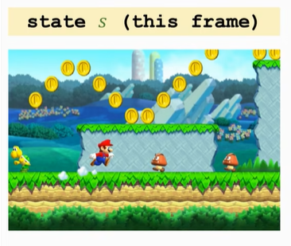
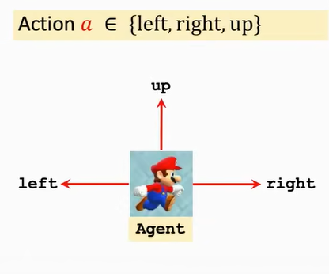
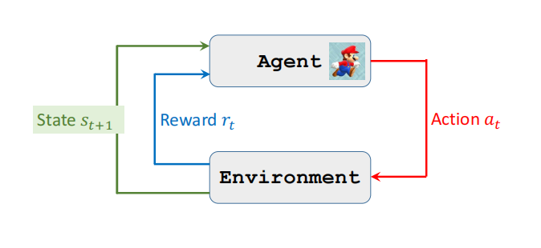

> # RL基础

1. **随机变量和随机变量**的观测值分别用大写和小写字母表示:      
    $X$: 随机变量       
    $x$: 观测值($x_1=0, x_2=1,...., x_n=0$) 

2. **Probability Density Function(PDF, 概率密度函数)**    
    某个物理变量在某个确定的取值点附近的分布    
    例:  
    **高斯分布**的概率密度函数
    $$p(x) = \frac{1}{\sqrt{2\pi \sigma^2}}exp(-\frac{(x-\mu^2)}{2\sigma^2})$$

    1. 概率密度函数的性质, 随机变量$X$在其定义域$\mathcal{X}$中
    2. 对于连续分布: 
    $$\int_{\mathcal{X}}p(x)dx = 1$$
    3. 对于离散分布
    $$\sum_{x\in\mathcal{X}}p(x) = 1$$

3. **Expectation(期望)**
    1. 概率密度函数的性质, 随机变量$X$在其定义域$\mathcal{X}$中
    1. 对于连续分布, $f(X)$的期望是: 
    $$E(f(X)) = \int_{\mathcal{X}}p(x)\cdot f(x)dx$$
    1. 对于离散分布
    $$E(f(X)) = \sum_{x\in\mathcal{X}}p(x)\cdot f(x)$$

4. **随机抽样**

> # RL Terminologies(RL术语)

## state($s$)
当前agent的状态，超级玛丽里面可以理解成当前的frame

## action($a$)

Mario的动作: 可以操纵Mario做的行为action, 即$a\in \{left, right, up\}$

这里面Mario是**agent(智能体)**, 即执行动作的个体

## policy($\pi$)
根据观测到的状态可以执行的动作, Policy一般是一个概率密度函数——即状态到动作的一个映射

例如当观测到当前Mario游戏的画面, 应该采取a\in \{left, right, up\}$的哪一个动作

- Policy function $\pi:(s, a) \rightarrow [0, 1]$, 强化学习学的就是Policy function
$$\pi(a|s) = P(A=a|S=s)$$
- 这代表了当处在状态$s$时采取$a$动作的概率, 此时会做一个随机抽样, 以不同的概率采取每个动作。
    - $\pi(left|s) = 0.2$
    - $\pi(right|s) = 0.1$
    - $\pi(up|s) = 0.7$
- 在观测到的state $S=s$中, 智能体的动作$A$是随机的。
    - agent的动作可以是随机/确定的, 随机是因为在例如博弈的场景下,如果对方了解你的policy function, 那么对方一定可以采取反制的方法。

## Reward($R$)

奖励通常需要自己定义, 直接决定训练的好坏
例如超级玛丽游戏中:
- 获得金币; $R=1$
- 赢得游戏: $R=1e5$
- 输给怪物: $R=-1e5$
- 什么都没有发生: $R=0$

强化学习的目标是$全过程奖励最大化$

## State transition(状态转移)

$$old\ state \stackrel{action}{\rightarrow} new\ state$$

一个动作(例如'up' action)导致当前的状态转移到新状态(new state)

- 状态转移通常是随机的
- 随机性通常是**环境**导致的
- 状态转移可以用一个条件概率密度函数$p$表示:
    $$p(s'|s,a)=\mathbb{P}(S'=s'|S=s, A=a)$$

## agent environment interaction(状态和环境的交互)

1. agent观察到当前的状态$s_t$做出一个动作$a_t$
2. 环境根据动作将状态更新为$s_{t+1}$, 并给agent一个奖励$r_t$

## Randomness In RL

1. 动作的随机性
    - 由于动作的随机性是根据policy函数随机抽样得到的
2. 状态转移的随机性
    - 根据状态$S$和动作$A$, 状态转移函数会随机生成一个新的状态$S'$

## Return(cumulative future reward, 未来的累计奖励)
- $Return$的定义:$t$时刻的回报记作$U_t$, 奖励记作$R_t$
    - $U_t = R_t + R_{t+1} + R_{t+2} + ....$ 
- 未来的奖励价值**低于**现在的同等奖励
    - 例: 现在拿到100和一年后拿到100
    - 因此需要给未来的奖励(reward打一个折扣), 即$R_{t+n}(n>0)$应该相比$R_t$的权重更低

- $Discounted\ return$的定义:
    - $\gamma \in (0,1)$: 折扣率(需要调整的超参) 
    - $U_t = R_t + \gamma R_{t+1} + \gamma^2 R_{t+2} + \gamma^3 R_{t+3} + ....$

### Return的随机性
- Return的随机性来源于两个方面
    1. 动作随机性: $\mathbb{P}(A=a|S=s)=\pi(a|s)$
    2. 状态随机性: $\mathbb{P}(S'=s'|S=s, A=a)=p(s'|s,a)$
- 对于任意$i\geq t$,奖励$R_i$取决于$S_i$和$A_i$
- 因此给定$s_t$, 对于$t$时刻的Return $U_t$依赖于以下随机变量:
    - $A_t, A_{t+1}, A_{t+2}....$
    - $S_{t+1}, S_{t+2}....$

## Value Function
### Action-Value Function——$Q(s,a)$

- 对于状态函数$\pi$的**动作价值函数**:   
    由于$U_t$是个随机变量, 评价$t$时刻的状态通过**求期望**得到

    $$Q_{\pi}(s_t, a_t) = \mathbb{E}[U_t|S_t=s_t, A_t=a_t]$$

    由于$U_t$依赖于一系列随机变量($A_t, A_{t+1}, A_{t+2}....$和$S_{t+1}, S_{t+2}....$), 因此**通过积分将除了$s_t, a_t$的随机变量全部通过积分积去**。

### Optimal action-value function
- $Q_{\pi}(s_t, a_t)$的直观意义: 当使用$\pi$作为policy function时, 在$s_t, a_t$下的Return有多少
- $Q_{\pi}(s_t, a_t)$通过$\pi$,即policy function决定状态转移, 为了评价当前动作的好坏, 通过**求$Q_{\pi}(s_t, a_t)$下最优的$\pi$得到最优的policy function**

    - $Q^*(s_t, a_t) = \underset{\pi}{max}Q_{\pi}(s_t, a_t)$

### State-Value Function——$V(s)$,状态价值函数
状态价值函数主要表示当前的状态怎么样, 通过将$A$通过积分消除
- $V_{\pi}=\mathbb{E}_A[Q_{\pi}(s_t, A)]  = \sum\pi(a|s_t)\cdot Q_\pi(s_t, a)$ (当动作是离散时)
- $V_{\pi}=\mathbb{E}_A[Q_{\pi}(s_t, A)]  = \int\pi(a|s_t)\cdot Q_\pi(s_t, a)da$ (当动作是连续时)

### Summary

1. 动作价值函数
    $$Q_{\pi}(s_t, a_t) = \mathbb{E}[U_t|S_t=s_t, A_t=a_t]$$
    $Q_{\pi}(s_t, a_t)$表示,当使用$\pi$的policy func, 当状态为$s$时选择动作$a$的好坏
2. 状态价值函数
    $$V_{\pi}=\mathbb{E}_A[Q_{\pi}(s_t, A)]$$
    1. $V_{\pi}$表示, 对于确定的$\pi$作为policy func, 当前的状态$s$怎么样
    2. $V_{\pi}$还可以表示, 对于确定的$s$, 当前的$\pi$怎么样