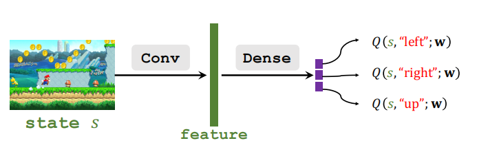
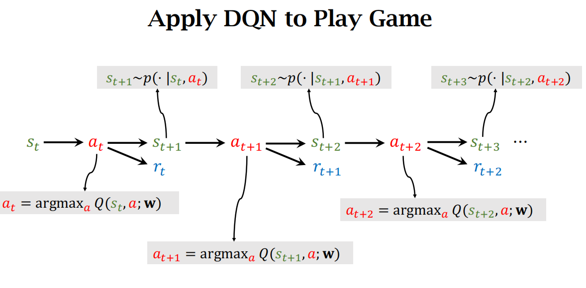

> # PRE
1. DQN
2. TD算法

> # DQN

- **目标**: maximize the total reward(获得最大化总回报)
- 如果已知$Q^*(s,a)$, 最优动作是:
    $$a^*=\underset{a}{argmax}\ Q^*(s,a)$$
    即根据当前的状态$s$, 在最优动作价值函数$Q^*$下, 最优动作$a^*$是什么
- 价值学习的基本思想: 学习出一个近似$Q^*$的函数
  - 解决方案: Deep Q Network(DQN)
  - 使用一个神经网络$Q(s,a;w)$去近似$Q^*(s,a)$
  - $w$是NN的参数, $s$是输入, $a$是输出

类比到Mario游戏当中, DRL首先对当前屏幕画面(state)通过DQN进行卷积以及全连接层, 最后输出**当前状态下采取每个动作的概率**。

### DQN如何应用到游戏中:

# Temporal Difference(TD) Learning

## Entry

- Q: 开车从纽约($NYC$)到亚特兰大($Atlanta$)需要多久?
- A: 模型$Q(w)$预测需要1000min

> **如何更新模型**?

1. 完成全车程的情况下:        
   1. 模型预测$Q(w)$计算出1000min, 实际使用860min
   2. 根据$Q(w)$与$y_{true}$利用梯度下降计算loss更新参数
2. 没有完成全车程的情况下:
   1. 假设开车从$NYC$到$Atlanta$需要经过华盛顿($DC$), 此时只有到达$DC$的车程,如何通过$NYC\rightarrow DC$的车程更新参数?
   2. 模型预测$Q(w)$计算出1000min, $NYC\rightarrow DC=300min$, 根据状态DC预测$DC\rightarrow Atlanta = 600min$.
   3. 可以根据$Q(w)$估计的$DC\rightarrow Atlanta$和实际的$NYC\rightarrow DC$得到总车程估计值为900min, 900min就是$TD\ Target$
   4. 利用$TD\ Target$与$Q(w)$算loss, 做梯度下降
   5. 虽然无法得到总路程, 但是TD算法得到的Target比模型估算总路程更加可靠

## 如何在DQN中应用TD learning

### 车程案例中:
$$T_{NYC\rightarrow ATL} \approx T_{NYC\rightarrow DC} + T_{DC\rightarrow ATL}$$
$$\downarrow$$
$$[Model's\ estimation] = [Actual\ time] + [Model's\ estimation]$$

### DRL中:
$$Q(s_t, a_t;w) \approx r_t + \gamma\cdot Q(s_{t+1},a_{t+1};w)$$
- 简单推导:
$$U_t = R_t + \gamma \cdot R_{t+1} + \gamma ^2 \cdot R_{t+2}...\\
=R_t + \gamma(R_{t+1} + \gamma \cdot R_{t+2}+\gamma^2 \cdot R_{t+3}...)\\
=R_t+U_{t+1}$$
> $\gamma$:折扣系数

###  TD learning for DQN

- t时刻, DQN的输出, $Q(s_t, a_t;w)$是$\mathbb{E}[U_t]$的一个评价
- t+1时刻, DQN的输出, $Q(s_{t+1}, a_{t+1};w)$是$\mathbb{E}[U_{t+1}]$的一个评价
- 因此, $Q(s_t, a_t;w)= \mathbb{E}[R_t+ \gamma \cdot Q(S_{t+1},A_{t+1};w)]$,则可以得到$Q(s_t, a_t;w)\approx r_t+ \gamma \cdot Q(s_{t+1},a_{t+1};w)$

### Train DQN using TD

- Pred: $Q(s_t, a_t; w_t)$
- TD Target:
     
  $y_t = r_t + \gamma \cdot Q(s_{t+1}, a_{t+1};w_t) \\
  =r_t + \gamma \cdot \underset{a}{max}Q(s_{t+1}, a;w_t)$

- Loss: $L_t=\frac{1}{2}[Q(s_t,a_t;w)-y_t]^2$