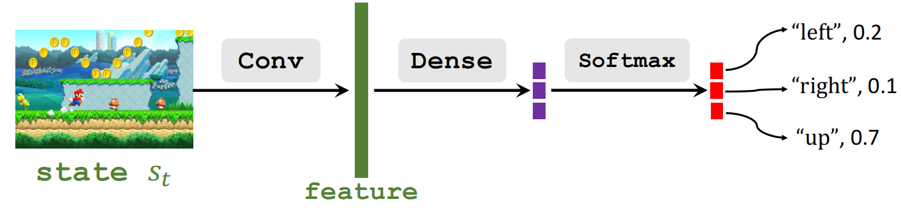
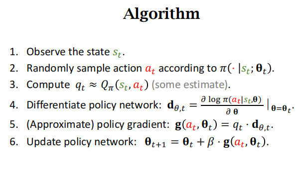

# Policy Based RL(策略学习)
- Policy Network(策略网络)
- Policy Gradient Learning

# Policy Network

- Policy Network: $\pi(a|s;\theta)$。利用策略网络近似策略函数$\pi(a|s)$
- $\theta$:神经网络的可训练参数

类比Mario游戏: 

> 注意此处和value-based learning的区别, 在value-based当中, DQN输出的实际上是**采取不同动作的未来总奖励期望, 最后用argmax取出最大值**, 而policy NN输出的是**给定当前状态下采取不同动作的概率,使用softmax**

### **State-Value Function**

### 状态价值函数的近似

- 状态价值函数
$$V_{\pi} = \mathbb{E}_A[Q_{\pi}(s_t,A)]=\sum_a\pi(a|s_t)\cdot Q_\pi(s_t,a)$$
- 利用policy network $\pi(a|s_t;\theta)$来近似$\pi(a|s_t)$
- 利用policy network近似状态价值函数:
    $V(s;\theta) = \sum_a\pi(a|s;\theta)\cdot Q_\pi(s,a)$

### 策略学习的主要思想

- **Policy-based learning**: 学习参数$\theta$,使$J(\theta)=\mathbb{E}_s[V(S;\theta)]$最大化
- 如何学习:
    1. 观测到state($s$)
    2. 优化policy: $\theta \leftarrow \theta + \beta\cdot \frac{\partial V(s;\theta)}{\partial \theta}$
        - $\frac{\partial V(s;\theta)}{\partial \theta}$(策略梯度)
    3. Policy gradient: 
        - 假设$Q_\pi$不依赖于$\theta$
        $$\frac{\partial V(s;\theta)}{\partial \theta}\\
        =\frac{\partial \sum_a\pi(a|s;\theta)\cdot Q_\pi(s,a)}{\partial \theta}\\
        =\sum_a \frac{\partial \pi(a|s;\theta)\cdot Q_\pi(s,a)}{\partial \theta}\\
        =\sum_a \frac{\partial \pi(a|s;\theta)}{\partial \theta}Q_\pi(s,a)$$ 

        - Chain rule:
        $$\frac{\partial log[\pi(\theta)]}{\theta} = \frac{1}{\pi(\theta)}\cdot \frac{\partial\pi(\theta)}{\partial \theta}\\
        \rightarrow \pi(\theta)\frac{\partial log[\pi(\theta)]}{\theta}=\pi(\theta)\cdot \frac{1}{\pi(\theta)}\cdot \frac{\partial\pi(\theta)}{\partial \theta}=\frac{\partial\pi(\theta)}{\partial \theta}$$

        - 根据Chain Rule:
        $$\frac{\partial V(s;\theta)}{\partial \theta}\\
        =\sum_a \frac{\partial \pi(a|s;\theta)}{\partial \theta}Q_\pi(s,a)\\
        =\sum_a \pi(a|s;\theta) \frac{\partial log\pi(a|s;\theta)}{\partial \theta}Q_\pi(s,a)$$

        - 此时, $\pi(a|s;\theta)$是个概率密度函数, 则对$a$做连加就是求期望操作
        $$\frac{\partial V(s;\theta)}{\partial \theta}\\
        =\sum_a \pi(a|s;\theta) \frac{\partial log\pi(a|s;\theta)}{\partial \theta}Q_\pi(s,a)\\
        =\mathbb{E}_A[\frac{\partial log\pi(A|s;\theta)}{\partial \theta}\cdot Q_\pi(s,A)]$$

    >  推导不够严谨, 因为假设$Q_\pi$不依赖于$\theta$, 但对$Q_\pi$求导结果也相同

### 计算策略梯度

1. 对于离散的动作集,使用第一种梯度形式:     
    1. 对于每个动作$a$, 求
    $$f(a,\theta)=\frac{\partial\pi(a|s;\theta)}{\partial\theta}\cdot Q_\pi(s,a)$$
    2. 策略梯度计算: 
    $$\frac{\partial V(s;\theta)}{\partial \theta} = \sum_af(a,\theta)$$

2. 对于连续的动作集, 假设$\mathcal{A}=[0,1]$
   1. $\frac{\partial V(s;\theta)}{\partial \theta} = \mathbb{E}_{A\sim\pi(\cdot|s;\theta)}[\frac{\partial log\pi(A|s;\theta)}{\partial \theta}\cdot Q_\pi(s,A)]$
   2. 该形式下, $\pi(\cdot|s;\theta)$是一个神经网络, 无法求积分, 因此采用**蒙特卡洛近似**
        1. 根据$\pi(\cdot|s;\theta)$的分布,随机抽样一个动作$\hat{a}$
        2. 计算如下的$g(\hat{a},\theta)$
        $$g(\hat{a},\theta) = \frac{\partial log\pi(\hat{a}|s;\theta)}{\partial \theta}\cdot Q_\pi(s,\hat{a})$$
        3. 显然$\mathbb{E}_A(g(A,\theta))=\frac{\partial V(s;\theta)}{\partial \theta}$, 因此$g(\hat{a},\theta)$是一个policy gradient的无偏估计量
        4. 利用$g(\hat{a},\theta)$去近似策略梯度

### Policy RL Fake Code

### HOW TO ESTIMATE $Q_\pi$

1. Reinforce方法
    1. 将(游戏)流程进行到结束，会得到一系列的状态、动作以及回报
    $$s_1, a_1, r_1, s_2, a_2, r_2,...,s_T, a_T, r_T$$
    2. 计算折扣回报:
    对于所有$t$,$$计算u_t=\sum^T_{k=t}\gamma^{k-t}r_k$$
    3. 由于$Q_\pi(s_t,a_t)=\mathbb{E}[U_t]$, 可以使用$u_t$近似$Q_\pi(s_t,a_t)$
    4. $q_t=u_t$
2. 利用神经网络近似$Q_\pi$
   1. 一个NN被称为actor,一个NN被称为critic, 即actor-critic方法