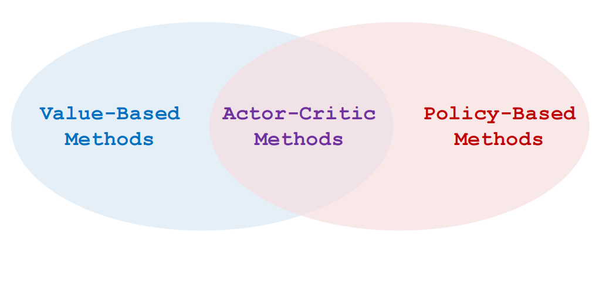
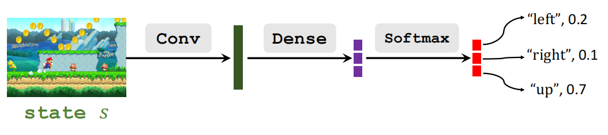
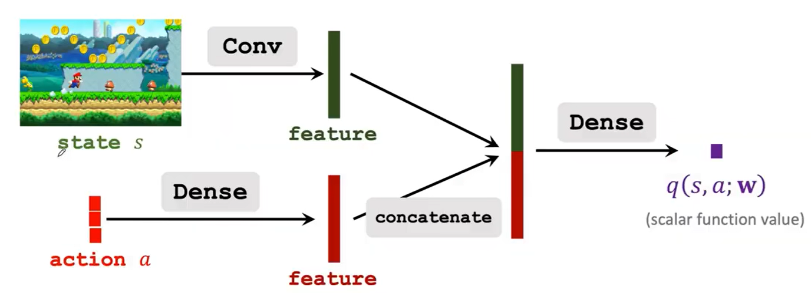
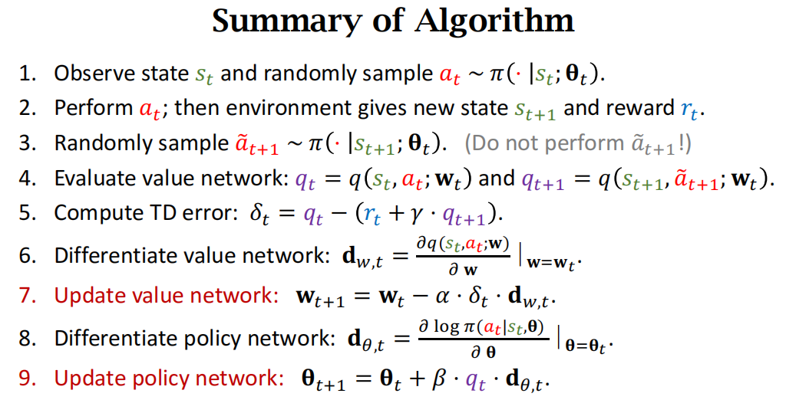

# Pre

- Actor:策略网络, 控制agent运动
- Critic:价值网络, 给动作打分
  

# State-Value Function Approx

- Def: State-Value function 状态价值函数
$$V_\pi(s)=\sum_a\pi(a|s)\cdot Q_\pi(s,a)$$
- Policy network(actor)    
    用神经网络$\pi(a|s;\theta)$近似策略函数$\pi(a|s)$(policy function)
- Value network(critic)     
    用神经网络$q(s,a;w)$近似动作价值函数$Q_\pi(s,a)$(action-value function)

**Thus**
$$V_\pi(s)\approx \sum_a\pi(a|s)\cdot q(s,a;w)$$

# Actor-Critic Methods

## Policy Network
- input: $s$
- output: **动作**$a$的概率分布,其中$\sum_{a\in \mathcal{A}}\pi(a|s,\theta)=1$

## Value Network
- input: 状态$s$和动作$a$
- output: 近似的**动作价值**

> 价值网络和策略网络可以共享卷积层或者分别train

# Train the Networks
- Def: 训练$\theta$以及$w$
- Training:
    1. 观察当前状态$s_t$
    2. 根据策略函数$\pi(\cdot|s_t;\theta_t)$随机选择一个动作$a_t$
    3. 执行$a_t$得到一个新状态$s_{t+1}$和一个奖励$r_t$
    4. 根据TD更新$w$(价值网络)
    5. 根据policy gradient更新$\theta$(策略网络)

> - 第3步sample的$\tilde{a}_{t+1}$不执行, TD算法计算用
> - 第9步的$q_t$,大部分论文会使用第5步使用的$\delta_t$(TD ERROR),使用$q_t$是标准算法, 使用$\delta_t$是policy gradient with baseline(通常使用baseline效果更好)。         
> - **Baseline**:任何接近$q_t$的数都可以作为baseline, 但baseline不可以是$a_t$的函数

