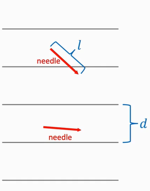
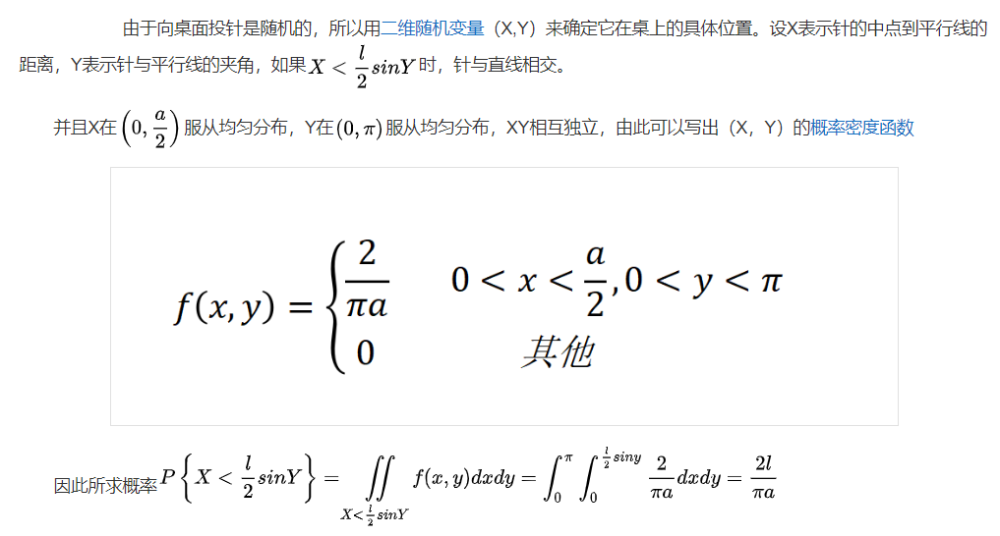

# Monte Carlo Algorithms
To illustrate by examples

## Application 1(Calculating $\pi$)

### Exp.1
1. 随机数生成器, 生成$[-1,1]$内均匀分布的随机数。随机生成$(x,y)$, 查看距离原点距离是否落在半径内
2. 多次随机采样$m$个点,一共有$n$个点在圆内。如果$n$非常大可以根据期望公式$Pn=\frac{\pi n}{4}$,计算$\pi$,其中$P$是落在圆内的概率。

> 该方法的Concentration bound: $|\frac{4m}{n}-\pi|=O(\frac{1}{\sqrt{n}})$,即多采样100倍,精度提高10倍。

### Exp.2(Buffon's Needle Problem)

- 一系列距离为$d$的平行线, 大量长度$l$的针, 假设针的角度和位置是随机的, 针与直线相交概率可以由$P=\frac{2l}{\pi d}$计算出来

## Application 2(Intergration, 求积分)

### Exp.1(Univariate)

- **Task**: 给定一元函数$f(x)$, 计算定积分$I=\int^b_af(x)dx$
    1. 在$[a,b]$上均匀分布采样$n$个样本, 记为$x_1,x_2,...x_n$
    2. 计算$Q_n = (b-a)\cdot \frac{1}{n}\sum^n_{i=1}f(x_i)$;以$Q_n$近似$I$

- **App**: 给定一元函数$f(x)=\cfrac{1}{1+sin(x)\cdot \ln(x)^2}$, 计算定积分$I=\int^3_{0.8}f(x)dx$
    1. 在$[0.8,3]$上均匀分布采样$n$个样本, 记为$x_1,x_2,...x_n$
    2. 计算$Q_n = 2.2\cdot \frac{1}{n}\sum^n_{i=1}f(x_i)$; 以$Q_n$近似$I$

### Exp.2(Multivariate)

- **Task**: 给定多元函数$f(\pmb{x})$, 计算定积分$I=\int_\Omega f(\pmb{x})dx$, 其中向量$\pmb{x} \in \mathbb{R}^d$, $\Omega \subset \mathbb{R}^d$
    1. 在$\Omega$上均匀分布采样$n$个样本, 记为$x_1,x_2,...x_n$
    2. 计算$V = \int_\Omega d\pmb{x}$;
    3. 计算$Q_n=V\cdot \frac{1}{n}\sum^n_{i=1}f(\pmb{x}_i)$; 以$Q_n$近似$I$

- **App**:计算如下函数定积分:
    $$y=
    \begin{cases}
        1, &if\ x^2+y^2\leq 1\\
        0, &otherwise
    \end{cases}
    $$
    其中设定义域$\Omega\in ([-1,1],[-1,1])$, $I=\int_\Omega f(x,y)dxdy$显然等于圆的面积,即$\pi$

    1. 随机抽样$n$个点, 计算$V=\int_\Omega dxdy=4$
    2. 计算$Q_n=4\cdot \frac{1}{n}\sum^n_{i=1}f(x_i,y_i)$

## Application 3(Expectation, 求期望)
- **Task Def:** 
    - $X$是d维度向量, $\pmb{x}$是一个$X$中的样本
    - $p(\pmb{x})$是概率密度函数(PDF)
    - $f(\pmb{x})$是任意函数
    - 期望:$\mathbb{E}_{X\sim p}[f(\pmb{x})]=\int_{\mathbb{R}^d}f(\pmb{x})p(\pmb{x})d\pmb{x}$

1. 根据$p(\pmb{x})$采样$n$个点
2. 计算$Q_n=\frac{1}{n}\sum^n_{i=1}f(\pmb{x}_i)$