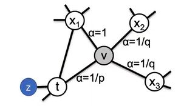
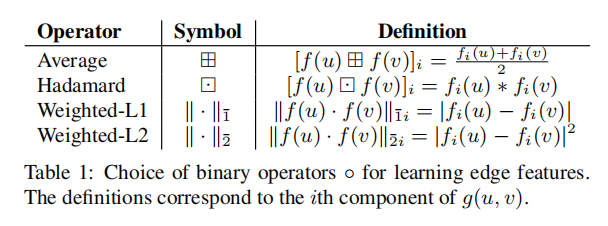

# Graph Embedding

## DeepWalk

## LINE

- REF: LINE: Large-scale Information Network Embedding

### 思想

LINE考虑了一阶相似性和二阶相似性
- **一阶相似性**: 两个节点有边, 且边权较大, 则两个节点Embedding应该相近
- **二阶相似性**: 两个共享邻居的节点可能是相似的
> DeepWalk在无向图上, LINE可以在有向图上使用
###  **一阶相似性**
1. 随机初始化节点嵌入
2. $i, j$节点**联合概率分布**:
    $$p_1(v_i, v_j) = \frac{1}{1+exp(-\vec{u_i}\cdot \vec{u_j})}$$
    其中$\vec{u_i},\vec{u_j}$是节点嵌入
3. $i, j$节点**经验概率分布**:
    $$\hat{p_1}(i,j) = \frac{w_{i,j}}{\sum w_{m,n}}$$
    即两点连接边权重除以所有边权重和

4. 求两分布距离(KL散度)——距离越小, 结果越好:
    $$D_{KL}(p||q)=\sum_{i=1}^np(x_i)log(\frac{p(x_i)}{q(x_i)})\\
    =\sum\frac{w_{i,j}}{W}log(\frac{w_{i,j}}{W}\cdot \frac{1}{p_1(v_i, v_j)})\\
    =\sum\frac{w_{i,j}}{W}[log(\frac{w_{i,j}}{W}) -  log(p_1(v_i, v_j))]\\
    =\sum\frac{w_{i,j}}{W}log(\frac{w_{i,j}}{W}) -  \sum\frac{w_{i,j}}{W}log(p_1(v_i, v_j))
    $$

    上述式子中$W=\sum_{(i,j)\in E}w_{i,j}$, 即所有边的权重和——常数, 可以去掉, 左项也是常数。因此上述式子简化为:
    $$O_1 = -\sum_{(i,j)\in E}w_{i,j}log\ p_1(v_1,v_2)$$
### **二阶相似性**
设两个向量:
1. $\vec{u}$: 顶点本身的向量
2. $\vec{u}'$: 作为邻居时的向量

- **$i,j$节点条件概率分布**

$$p(v_j|v_i)=\frac{exp(\vec{u_j'}^T\cdot\vec{u_i})}{\sum_{k=1}^{|V|}exp(\vec{u_k'}^T\cdot\vec{u_i})}$$

> 这里只求有向图中出边相连的节点, 无向图可以转为双向的有向图

- **$i,j$节点经验条件概率分布**
$$\hat{p_2}(v_j|v_i)=\frac{w_{ij}}{di}$$
其中$d_i=\sum_{k\in N(i)}w_{i,k}$, 即出度的和

- **二阶损失函数**

KL散度简化后:
$$O_2 = -\sum_{(i,j)\in E}w_{ij}logp_2(v_j|v_i)$$

### 节点嵌入

拼接1st-order和2nd-order的向量作为节点嵌入
> 这里的二阶嵌入指的是二阶的两个向量中的$\vec{u}$, 不是$\vec{u}'$

## Node2Vec
### 思想
1. **节点embedding的内容**
   - 同质性(homophily): 节点和周围节点的embedding应该比较相似
   - 同构性/结构等价性(structural equivalence): 节点embedding主要取决于在图/子结构中的位置。
2. **随机游走**
   - DFS
   - BFS

### 基于概率的随机游走
类似于DeepWalk方法, 但游走选择节点是基于策略(概率)

1. 假设当前节点已经由节点$t\rightarrow v$
2. 那么在节点$v$的转移概率函数是: 
    $$\pi_{vx}=\alpha_{pq}(t,x)$$
    其中:
    $$
    \alpha_{pq}(t,x)= 
    \begin{cases}
    \frac{1}{p}, & if\ d_{tx}=0\\
    1, & if\ d_{tx}=1\\
    \frac{1}{q}, & if\ d_{tx}=2\\
    \end{cases}
    $$

- **例子**:
1. $t\rightarrow v \rightarrow z: 0$ ,由于$d_{t,z}=1, w_{v,z}=0$
2. $t\rightarrow v \rightarrow t: w_{v,t}*\frac{1}{p}$ ,由于$d_{t,t}=0, w_{v,z}\neq0$
3. $t\rightarrow v \rightarrow x_1: w_{v,x_1}$ ,由于$d_{t,x_1}=1$
4. $t\rightarrow v \rightarrow t: w_{v,x_3}*\frac{1}{q}$ ,由于$d_{t,t}=2$

### 训练过程

1. 输入嵌入长度$d$, 每个节点的游走个数$r$, 游走长度$l$, 窗口长度$k$, Return概率$p$及In-Out概率$q$。
2. 根据以上随机游走过程与参数建立随机游走序列
3. 利用Skip-Gram训练节点嵌入

### **Loss**

最大化邻居节点在中心节点周围出现的概率: 

$$\underset{f}{max}\sum_{u\in V}logPr(N_S(u)|f(u))$$

### **提高效率**:
进行一个较长的随机游走, 根据Context Size进行滑窗后可以采样多个子序列。

### **p和q**

1. p较高时有高概率远离源节点——接近DFS, 因此能够学习到更好的同质性(相邻节点表征类似)
2. q较高时有高概率返回源节点——接近BFS, 因此能学习到更好的同构性

### **Edge Embedding**
获取边嵌入的方法:

## Struct2Vec
## SDNE